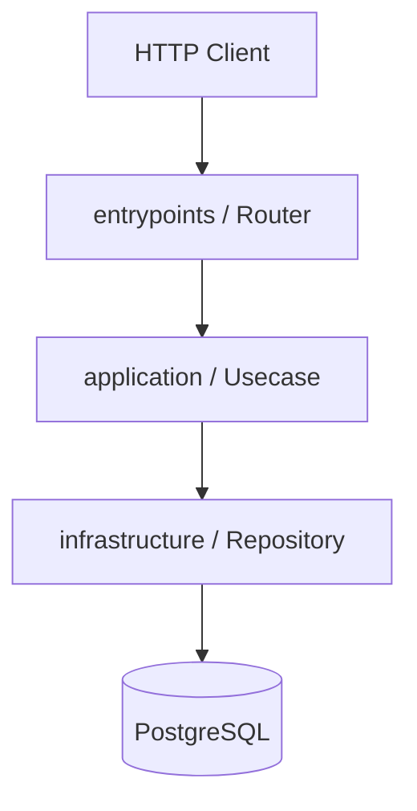
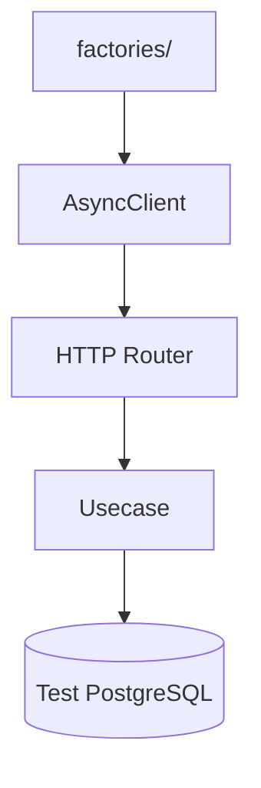

# spec

## Описание

`.specs` хранит бизнес-постановки фич. Каждый файл — один сценарий, читаемый и для системного аналитика, и для агентов-исполнителей.

## Структура директории

```text
.specs/
└── <domain>/
    ├── create.md
    ├── get.md
    └── delete.md
```

Один файл = один бизнес-сценарий (не один исходный файл).

## Формат

```md
# [Название сценария]

## Описание

Что делает этот сценарий с точки зрения бизнеса.

## Задачи

| # | Область | Описание |
|---|---------|----------|
| 1 | Backend | Создать доменную модель, таблицу, usecase, HTTP-роутер |
| 2 | Testing | Написать интеграционный тест HTTP-сценария |

---

## Backend

### Схема взаимодействия



### Задачи

| # | Слой | Путь | Действие | Описание |
|---|------|------|----------|----------|
| 1 | domain | src/domain/models/account.py | create | Доменная модель аккаунта |
| 2 | infrastructure | src/infrastructure/databases/postgres/tables/accounts.py | create | ORM-таблица |
| 3 | infrastructure | src/infrastructure/databases/postgres/crud/accounts.py | create | CRUD-класс |
| 4 | infrastructure | src/infrastructure/databases/postgres/adapters/repositories/accounts.py | create | Repository-адаптер |
| 5 | application | src/application/usecases/accounts/create.py | create | Usecase создания |
| 6 | entrypoint | src/entrypoints/http/public/routers/accounts/create.py | create | HTTP-роутер |
| 7 | entrypoint | src/entrypoints/http/public/schemas/accounts.py | create | Pydantic-схемы запроса/ответа |

---

## Testing

### Схема взаимодействия



### Задачи

| # | Слой | Путь | Действие | Описание |
|---|------|------|----------|----------|
| 1 | tests | tests/factories/domain/models/account.py | update | Фабрика доменной модели |
| 2 | tests | tests/test_integrations/test_entrypoints/test_http/test_public/test_accounts/test_create.py | create | Интеграционный тест |


## Правила

- Не добавляй даты и статусы в spec.md.
- Пиши поведение без кода и без вариантов решения.
- Не смешивай несвязанные сценарии в одном файле.
- Агенты читают `.instructions/src.md` и `.instructions/tests.md` для понимания правил реализации.
- Колонка «Действие»: `create` — файла ещё нет, `update` — файл существует и нужно дополнить.
