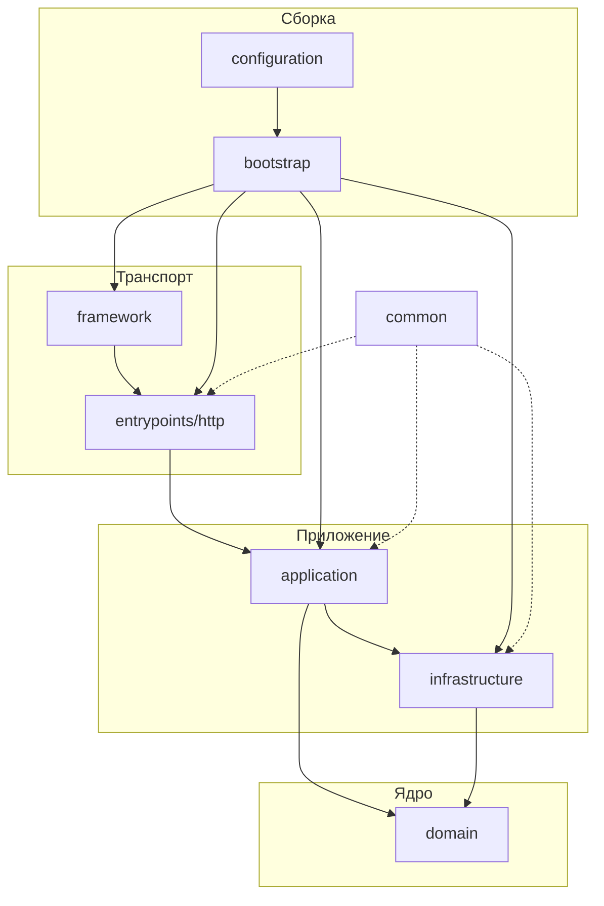

## Содержание

- [Архитектура](#архитектура)
  - [Схема](#схема)
  - [Примеры](#примеры)
    - [Command — accounts/create](#command--accountscreate)
    - [Query — accounts/current](#query--accountscurrent)
- [Код стайл](#код-стайл)
  - [Правила импортов](#правила-импортов)
- [Структура проекта](#структура-проекта)
  - [domain](#domain)
  - [application](#application)
    - [usecases](#usecases)
    - [utils](#utils)
  - [infrastructure](#infrastructure)
    - [databases](#databases)
      - [orm](#orm)
      - [postgres](#postgres)
    - [security](#security)
      - [jwt](#jwt)
      - [encryption](#encryption)
    - [storages](#storages)
      - [redis](#redis)
    - [monitoring](#monitoring)
  - [entrypoints/http](#entrypointshttp)
  - [framework](#framework)
  - [common](#common)
  - [bootstrap](#bootstrap)

---

# Архитектура

---

Проект построен по луковичной архитектуре. Ядро (`domain`) не знает ни о чём вокруг. Каждый внешний слой зависит от внутренних, но не наоборот. `infrastructure` реализует контракты домена снизу. `common` — горизонтальный разделяемый слой без бизнес-логики.

## Схема

---



## Примеры

---

### Command — accounts/create

---

Полная цепочка от HTTP-запроса до записи в БД.

```python
# domain/models/account.py
class Account(Base):
    id: int
    external_id: str
    created_at: datetime
    updated_at: datetime
    __encrypted__ = ("external_id",)

# domain/collections/exceptions/account.py
class AccountAlreadyExists(HTTPError): ...

# infrastructure/databases/postgres/tables/account.py
class Account(Base):
    __tablename__ = "account"
    id = Column(BigInteger, primary_key=True)
    external_id = Column(String(length=LENGTH_SMALL_STR), nullable=False, unique=True)
    created_at = Column(DateTime(timezone=True), nullable=False)
    updated_at = Column(DateTime(timezone=True), nullable=False)

# infrastructure/databases/postgres/crud/account.py
class Account(Base[tables.Account]):
    table = tables.Account

# infrastructure/databases/postgres/adapters/repositories/account.py
class Account(Base):
    async def create(self, model: domain.Account) -> domain.Account: ...
    async def exists(self, external_id: str) -> bool: ...

# application/usecases/accounts/create.py
class Usecase:
    def __init__(self) -> None:
        self.container: Container | None = None

    def build(self, session: Session) -> None:
        self.container = Container(repository=Repository(session))

    @sessionmaker.write
    async def __call__(self, session: Session, external_id: str) -> Tokens:
        self.build(session)
        await self.validate(external_id=external_id)
        account = await self.container.repository.account.create(
            model=Account.init(
                **Account.encrypt(
                    encrypter=self.container.security.encryption.encrypt,
                    external_id=external_id,
                ),
            )
        )
        return self.container.security.jwt.encode(subject=str(account.id))

# entrypoints/http/public/schemas/account.py
class CreateAccount(Command):
    external_id: str

# entrypoints/http/public/deps/accounts/create.py
def create() -> Usecase:
    return Usecase()

# entrypoints/http/public/routers/accounts/create.py
@router.post("/api/accounts", response_model=Tokens)
async def handler(
    body: CreateAccount,
    usecase: Annotated[Usecase, Depends(deps.create)],
) -> Tokens:
    return await usecase(external_id=body.external_id)
```

### Query — accounts/current

---

Полная цепочка от HTTP-запроса до чтения из БД.

```python
# application/usecases/accounts/current.py
class Usecase:
    def __init__(self) -> None:
        self.container: Container | None = None

    def build(self, session: Session) -> None:
        self.container = Container(repository=Repository(session))

    @sessionmaker.read
    async def __call__(self, session: Session, token: str) -> Account:
        self.build(session)
        payload = self.container.security.jwt.decode(token=token)
        account = await self.container.repository.account.one(
            Filter.eq(key="id", value=payload.sub)
        )
        return Account.decrypt(
            decrypter=self.container.security.encryption.decrypt,
            account=account,
        )

# entrypoints/http/public/schemas/account.py
class CurrentAccount(Response):
    id: int
    external_id: str
    created_at: datetime
    updated_at: datetime

# entrypoints/http/public/deps/accounts/current.py
def current() -> Usecase:
    return Usecase()

# entrypoints/http/public/routers/accounts/current.py
@router.get("/api/accounts:current", response_model=CurrentAccount)
async def handler(
    token: Annotated[str, Depends(security.jwt)],
    usecase: Annotated[Usecase, Depends(deps.current)],
) -> CurrentAccount:
    account = await usecase(token=token)
    return CurrentAccount.model_validate(account.model_dump())
```

---

# Код стайл

---

## Правила импортов

---

Группируй блоками: стандартная библиотека → сторонние пакеты → импорты проекта. Между группами одна пустая строка. Между верхнеуровневыми классами и функциями — одна пустая строка. Если пакет экспортирует объекты через `__init__.py`, импортируй из пакета, а не из внутренних файлов.

```python
from src.domain.collections import AccountNotFound
from src.domain.models import Account
from src.infrastructure.databases.postgres import adapters, crud, tables
```

---

# Структура проекта

---

## domain

---

Ядро системы. Содержит бизнес-типы, состояния, ошибки и константы. Не зависит ни от одного другого слоя проекта.

- Не импортирует `entrypoints`, `application`, `tables`, `crud`, adapters и инфраструктуру.
- Модели экспортируй через `src.domain.models`, коллекции через `src.domain.collections`.
- Публичные объекты собирай в `__init__.py` через явные импорты и `__all__`.
- Доменные исключения наследуй от `HTTPError` из `common/http/collections` — допустимо.

```python
# src/domain/models/account.py
class Account(Base):
    id: int
    external_id: str
    created_at: datetime
    updated_at: datetime
    __encrypted__ = ("external_id",)

    @classmethod
    def init(cls, **kwargs) -> "Account": ...

    @classmethod
    def encrypt(cls, encrypter, **kwargs) -> dict: ...

    @classmethod
    def decrypt(cls, decrypter, account: "Account") -> "Account": ...

# src/domain/collections/exceptions/account.py
class AccountAlreadyExists(HTTPError): ...
class AccountNotFound(HTTPError): ...
```

---

## application

---

Слой бизнес-сценариев. Оркестрирует домен и инфраструктуру. Не знает о HTTP, SQL и деталях транспорта.

### usecases

---

Один файл = одна операция: `usecases/<domain>/<operation>.py`. Основной класс — `Usecase`.

- Зависимости собирай через `build(session)` и `self.container`. Вызов через `__call__(...)`.
- **create** — конфликт существования через `{Model}AlreadyExists`. Создавай через `Model.init(...)`. Если есть `__encrypted__`, шифруй до записи. Возвращай расшифрованную модель.
- **get** — возвращает одну сущность. Разные способы чтения — разные файлы в `get/`. Не смешивай с `search`. Возвращай расшифрованную модель.
- **delete** — проверяй существование до удаления через явный поиск сущности.

```python
# src/application/usecases/accounts/create.py
class Usecase:
    def __init__(self) -> None:
        self.container: Container | None = None

    def build(self, session: Session) -> None:
        self.container = Container(repository=Repository(session))

    @sessionmaker.write
    async def __call__(self, session: Session, external_id: str) -> Tokens:
        self.build(session)
        await self.validate(external_id=external_id)
        account = await self.container.repository.account.create(
            model=Account.init(
                **Account.encrypt(
                    encrypter=self.container.security.encryption.encrypt,
                    external_id=external_id,
                ),
            )
        )
        return self.container.security.jwt.encode(subject=str(account.id))
```

### utils

---

Вспомогательные функции для usecase-слоя: decrypt-хелперы, валидаторы и другие переиспользуемые операции.

- Размещай только то, что переиспользуется в нескольких usecase.
- Не тащи сюда HTTP-детали и SQL.

---

## infrastructure

---

Реализации внешних зависимостей: базы данных, безопасность, хранилища, мониторинг. Реализует domain-контракты снизу.

### databases

---

Работа с реляционными базами данных. Два уровня: `orm` — универсальная async-абстракция; `postgres` — конкретная реализация.

#### orm

---

Универсальный async-клиент поверх SQLAlchemy: `AsyncEngine`, `async_sessionmaker`, строители запросов (`filter`, `pagination`, `sorting`), базовый CRUD (`fetchone`, `fetchall`, `fetchcount`), модели фильтров (`Filter`, `And`, `Or`), профилировщик SQL-запросов.

- Не зависит от конкретных Postgres-адаптеров.
- `ClientDisabled` поднимается при использовании неинициализированного клиента.

#### postgres

---

Конкретная реализация под Postgres. Новая сущность проходит через `tables → crud → adapters/repositories`.

- **tables** — только форма данных. Один домен = один файл. Экспортируй через `tables/__init__.py`.
- **crud** — SQLAlchemy statement-логика. Entity-specific запросы (`search`, `filter`) собирай здесь. Возвращай table rows, не доменные модели. Один домен = один файл. Экспортируй через `crud/__init__.py`.
- **adapters/repositories** — адаптирует CRUD к domain-контракту. Возвращает domain-модели. Statement-логику сюда не тащи.
- Миграции создавай отдельно через Alembic. Runtime-код не смешивай с миграциями.

```python
# src/infrastructure/databases/postgres/tables/account.py
class Account(Base):
    __tablename__ = "account"
    id = Column(BigInteger, primary_key=True)
    external_id = Column(String(length=LENGTH_SMALL_STR), nullable=False, unique=True)
    created_at = Column(DateTime(timezone=True), nullable=False)
    updated_at = Column(DateTime(timezone=True), nullable=False)

# src/infrastructure/databases/postgres/crud/account.py
class Account(Base[tables.Account]):
    table = tables.Account

# src/infrastructure/databases/postgres/adapters/repositories/account.py
class Account(Base):
    async def create(self, model: domain.Account) -> domain.Account: ...
    async def exists(self, external_id: str) -> bool: ...
    async def one(self, *filters) -> domain.Account: ...  # raises AccountNotFound
    async def delete(self, account_id: int) -> None: ...
```

### security

---

Реализации безопасности: JWT-токены и шифрование полей.

#### jwt

---

Выпуск и декодирование JWT-токенов.

- `encode(subject)` — выпускает пару access/refresh токенов.
- `decode(token)` — возвращает payload-модель. Поднимает исключение при невалидном или истёкшем токене.

```python
tokens = self.container.security.jwt.encode(subject=str(account.id))
payload = self.container.security.jwt.decode(token=token)
```

#### encryption

---

Симметричное шифрование строковых полей.

- Используй только через методы доменной модели: `Model.encrypt(encrypter=..., ...)` и `Model.decrypt(decrypter=..., ...)`.
- Не вызывай `encrypt`/`decrypt` напрямую в usecase — только через модель.

```python
encrypted = Account.encrypt(encrypter=self.container.security.encryption.encrypt, external_id=raw)
decrypted = Account.decrypt(decrypter=self.container.security.encryption.decrypt, account=account)
```

### storages

---

Key-value хранилища.

#### redis

---

Async Redis-клиент для кеширования и сессий.

- Клиент инициализируется через `setup` lifecycle-функцию в bootstrap.
- Только операции get/set/delete — не размещай бизнес-логику.
- `ClientDisabled` поднимается при использовании неинициализированного клиента.

### monitoring

---

Наблюдаемость приложения: логирование, health-check, детектор блокировок asyncio.

- **logging** — JSON-форматтер, парсеры и маперы для структурированных логов. Форматтеры не содержат бизнес-логику.
- **health** — эндпоинт проверки состояния сервиса, подключается через system-контур.
- **asyncio/detector** — перехватчик блокирующих операций в event loop, подключается в bootstrap.

---

## entrypoints/http

---

Транспортный слой. Принимает HTTP-запросы, вызывает usecase через FastAPI DI и возвращает HTTP-ответы. Не содержит бизнес-логику.

- Новый домен: `routers/<domain>/`, `deps/<domain>/`, `schemas/`, регистрация в `registry.py`.
- `deps/<domain>/` — фабрики usecase для FastAPI DI.
- `common/` — разделяемые схемы (CQRS, pagination, sorting) и security-зависимости (jwt, basic auth).
- Публичный контур (`public/`) не содержит system-only деталей. Системный (`system/`) защищён Basic Auth.
- При удалении функциональности удаляй пустые папки и обновляй `registry.py`.

```python
# src/entrypoints/http/public/schemas/account.py
class CreateAccount(Command):
    external_id: str

class CurrentAccount(Response):
    id: int
    external_id: str

# src/entrypoints/http/public/deps/accounts/create.py
def create() -> Usecase:
    return Usecase()

# src/entrypoints/http/public/routers/accounts/create.py
@router.post("/api/accounts", response_model=Tokens)
async def handler(
    body: CreateAccount,
    usecase: Annotated[Usecase, Depends(deps.create)],
) -> Tokens:
    return await usecase(external_id=body.external_id)
```

---

## framework

---

Инфраструктура FastAPI: кастомный роутер, OpenAPI-настройка, фоновые задачи. Не содержит бизнес-логику.

- `routing/` — кастомный роутер поверх FastAPI.
- `openapi/` — настройка схемы, operation ID, affixes.
- `background/` — фоновые задачи.

---

## common

---

Горизонтальный разделяемый слой. Утилиты без привязки к домену, используемые в любом слое.

- `formats/` — работа с датами, строками, JSON, UUID, base64 и др.
- `http/` — HTTP-перечисления и базовые исключения (`HTTPError`).
- `typings/` — валидаторы и переменные типов.
- `configuration/` — настройки приложения через Pydantic Settings.
- `decorators/` — переиспользуемые декораторы (`sessionmaker.read`, `sessionmaker.write`).

---

## bootstrap

---

Единственное место сборки приложения. Подключает routers, middleware, lifecycle, конфигурацию. Не содержит бизнес-логику и не является точкой входа для usecase.
