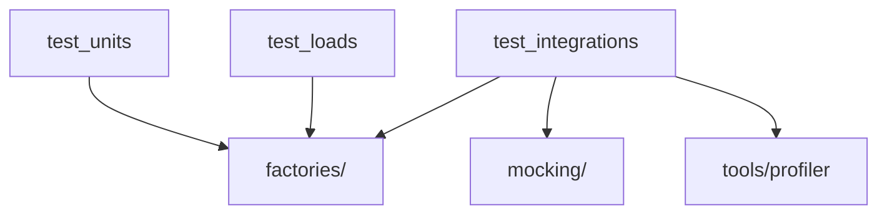

# tests

## Структура



```text
tests/
├── factories/
│   ├── domain/
│   └── infrastructure/
├── mocking/
│   └── infrastructure/
├── test_integrations/
│   └── test_entrypoints/
│       └── test_http/
│           ├── test_public/
│           └── test_system/
├── test_loads/
├── test_units/
└── tools/
    └── profiler/
        ├── contextmanagers/
        ├── models/
        ├── profilers/
        └── reports/
```

## Правила

- Тесты размещай в зеркальной структуре относительно production-кода.
- Используй `pytest`.
- Для тестовых данных используй `tests.faker.fake` и фабрики из `tests/factories/` — не дублируй данные вручную.
- В первую очередь покрывай HTTP-сценарии интеграционными тестами.

```python
from tests.faker import fake
from tests.factories.domain.models import Account
from tests.mocking.infrastructure.storages.redis import Redis
```

## test_integrations

- Для HTTP используй `httpx.AsyncClient`.
- Для доступа к БД используй `AsyncSession` и существующие фикстуры.
- Оформляй тест в стиле `given / when / then`, если это не ухудшает читаемость.

```python
class TestAccountCreate:
    async def given(self) -> None: ...

    async def when(self) -> Tokens:
        request = await self.client.post("/api/accounts:create", json={"external_id": fake.uuid4()})
        request.raise_for_status()
        return Tokens.model_validate(request.json())

    async def then(self) -> None: ...
```
