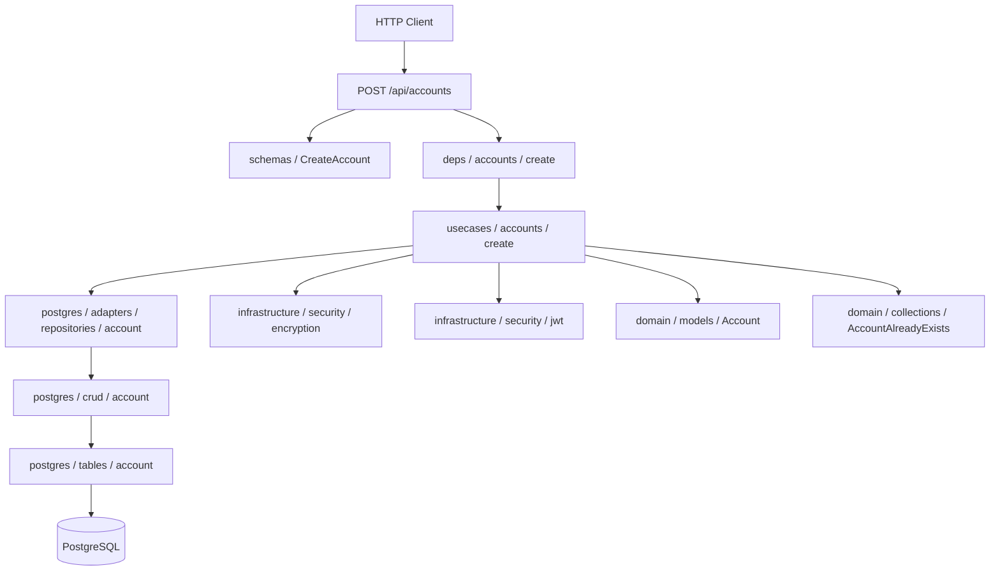
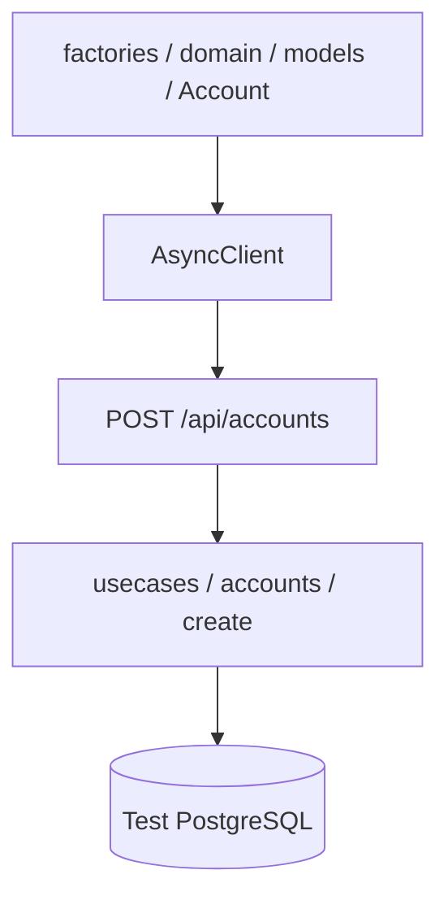

# Создание аккаунта

## Описание

Регистрация нового аккаунта по `external_id`. Проверяет уникальность, шифрует `external_id`, создаёт запись и возвращает пару JWT access/refresh токенов.

## Задачи

| # | Область | Описание |
|---|---------|----------|
| 1 | Backend | Доменная модель и исключения, ORM-таблица, CRUD, репозиторий, usecase, HTTP-схемы и роутер |
| 2 | Testing | Интеграционный тест POST /api/accounts |

---

## Backend

### Схема взаимодействия

### Задачи

| # | Слой | Путь | Действие | Описание |
|---|------|------|----------|----------|
| 1 | domain | src/domain/models/account.py | create | Модель `Account`: поля `id`, `external_id`, `created_at`, `updated_at`, `__encrypted__` |
| 2 | domain | src/domain/collections/exceptions/account.py | create | Исключения `AccountAlreadyExists`, `AccountBlocked`, `AccountNotFound` |
| 3 | infrastructure | src/infrastructure/databases/postgres/tables/account.py | create | ORM-таблица `account` с колонками id, external_id, created_at, updated_at |
| 4 | infrastructure | src/infrastructure/databases/postgres/crud/account.py | create | CRUD-класс `Account`: базовые операции над таблицей аккаунтов |
| 5 | infrastructure | src/infrastructure/databases/postgres/adapters/repositories/account.py | create | Repository-адаптер: get, exists, create, delete; поднимает `AccountNotFound` |
| 6 | application | src/application/usecases/accounts/create.py | create | Usecase: проверка уникальности по `external_id`, шифрование, создание, выпуск JWT |
| 7 | entrypoint | src/entrypoints/http/public/schemas/account.py | create | Pydantic-схема `CreateAccount` (запрос) |
| 8 | entrypoint | src/entrypoints/http/public/deps/accounts/create.py | create | Dependency-фабрика usecase создания |
| 9 | entrypoint | src/entrypoints/http/public/routers/accounts/create.py | create | `POST /api/accounts` → возвращает `Tokens` |

---

## Testing

### Схема взаимодействия

### Задачи

| # | Слой | Путь | Действие | Описание |
|---|------|------|----------|----------|
| 1 | tests | tests/factories/domain/models/account.py | create | Фабрика доменной модели `Account` |
| 2 | tests | tests/test_integrations/test_entrypoints/test_http/test_public/test_accounts/test_create.py | create | Тест: успешное создание возвращает `Tokens`; повторный запрос с тем же `external_id` — 4xx |
