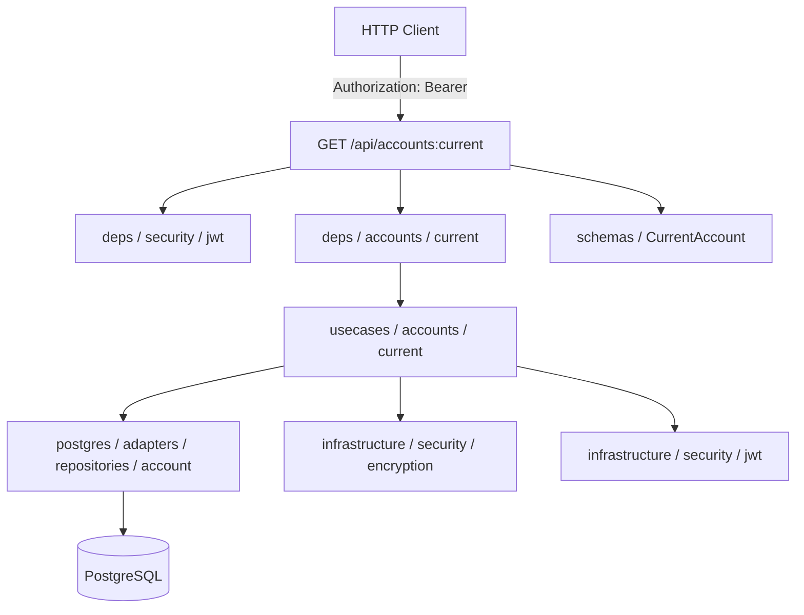
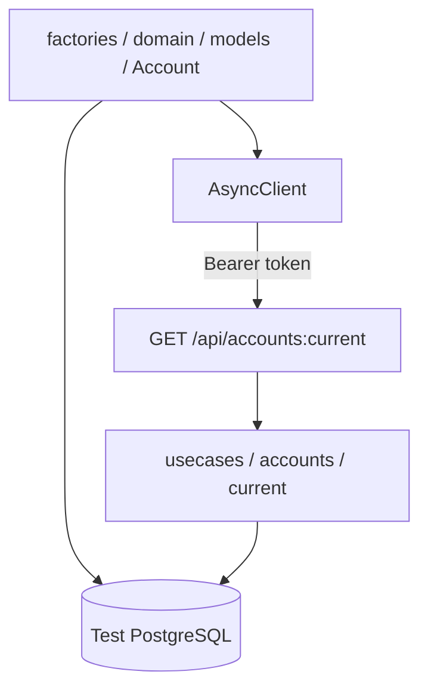

# Получение текущего аккаунта

## Описание

Возвращает данные текущего пользователя по access JWT-токену. Декодирует токен, читает аккаунт из БД и возвращает расшифрованную доменную модель.

## Задачи

| # | Область | Описание |
|---|---------|----------|
| 1 | Backend | Usecase, HTTP-схема ответа, dependency, роутер |
| 2 | Testing | Интеграционный тест GET /api/accounts:current |

---

## Backend

### Схема взаимодействия

### Задачи

| # | Слой | Путь | Действие | Описание |
|---|------|------|----------|----------|
| 1 | application | src/application/usecases/accounts/current.py | create | Usecase: декодирование JWT → `account_id`, чтение из БД, расшифровка `external_id` |
| 2 | entrypoint | src/entrypoints/http/public/schemas/account.py | update | Добавить схему `CurrentAccount` (ответ) |
| 3 | entrypoint | src/entrypoints/http/public/deps/accounts/current.py | create | Dependency-фабрика usecase получения текущего аккаунта |
| 4 | entrypoint | src/entrypoints/http/public/routers/accounts/current.py | create | `GET /api/accounts:current` → возвращает `CurrentAccount` |

---

## Testing

### Схема взаимодействия

### Задачи

| # | Слой | Путь | Действие | Описание |
|---|------|------|----------|----------|
| 1 | tests | tests/test_integrations/test_entrypoints/test_http/test_public/test_accounts/test_current.py | create | Тест: валидный токен → `CurrentAccount`; невалидный токен → 4xx |
