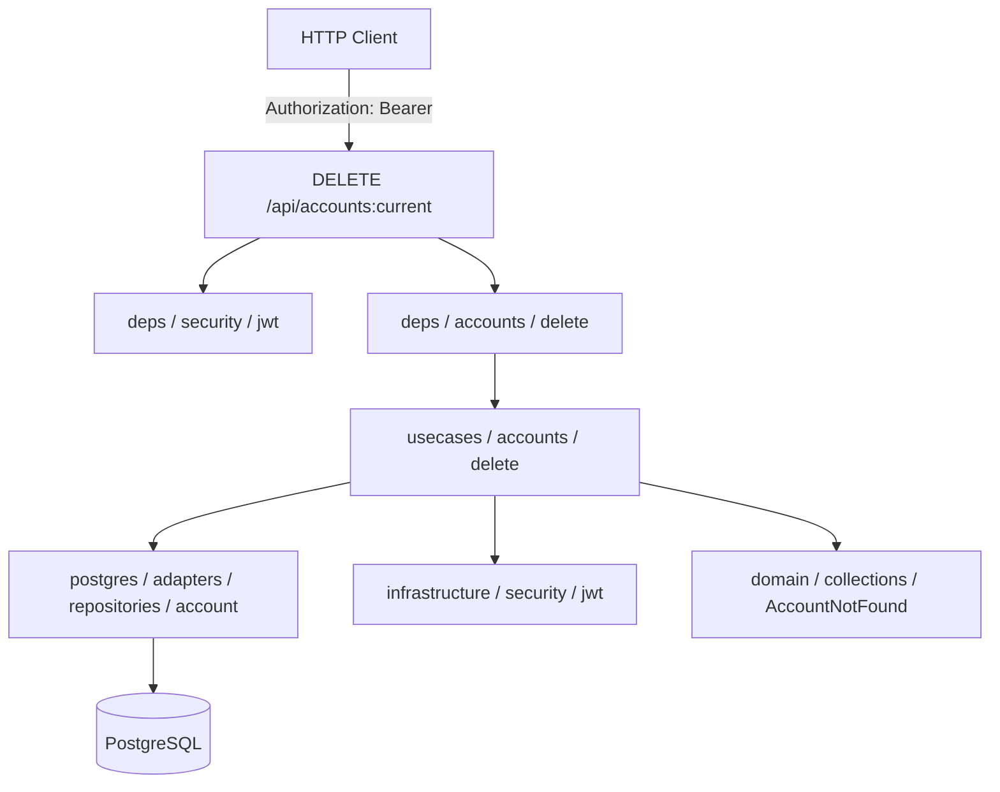
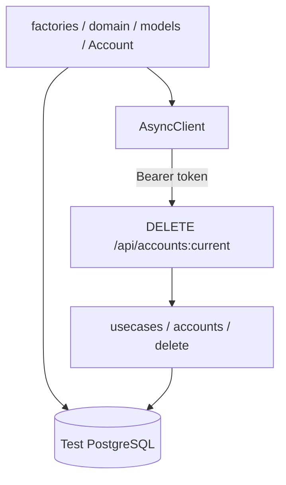

# Удаление аккаунта

## Описание

Удаляет текущий аккаунт по access JWT-токену. Декодирует токен, извлекает `account_id` и удаляет запись. Если аккаунт не найден — поднимает `AccountNotFound`.

## Задачи

| # | Область | Описание |
|---|---------|----------|
| 1 | Backend | Usecase, dependency, роутер |
| 2 | Testing | Интеграционный тест DELETE /api/accounts:current |

---

## Backend

### Схема взаимодействия

### Задачи

| # | Слой | Путь | Действие | Описание |
|---|------|------|----------|----------|
| 1 | application | src/application/usecases/accounts/delete.py | create | Usecase: декодирование JWT → `account_id`, удаление; `AccountNotFound` если не найден |
| 2 | entrypoint | src/entrypoints/http/public/deps/accounts/delete.py | create | Dependency-фабрика usecase удаления |
| 3 | entrypoint | src/entrypoints/http/public/routers/accounts/delete.py | create | `DELETE /api/accounts:current` → HTTP 204, без тела ответа |

---

## Testing

### Схема взаимодействия

### Задачи

| # | Слой | Путь | Действие | Описание |
|---|------|------|----------|----------|
| 1 | tests | tests/test_integrations/test_entrypoints/test_http/test_public/test_accounts/test_delete.py | create | Тест: успешное удаление → HTTP 204; повторный запрос → 4xx |
