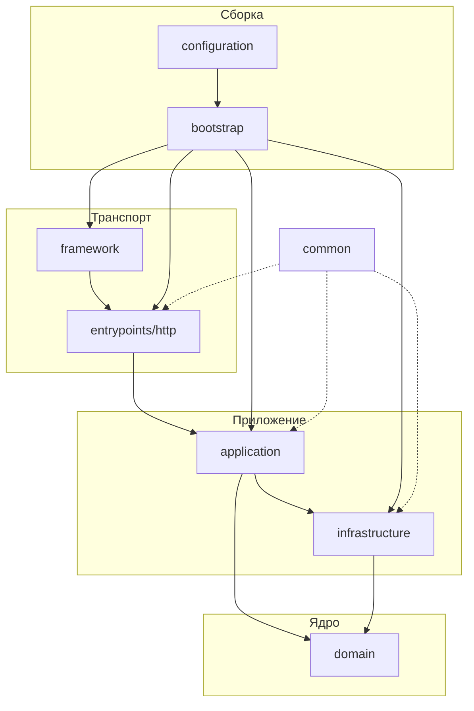

# Архитектура

## Идея

Проект построен как набор предсказуемых сквозных операций.

Каждая операция проходит один и тот же путь:

```text
HTTP schema -> dependency -> router -> usecase -> repository -> database
```

Архитектурная цель шаблона:

- каждая операция реализуется одинаково;
- транспортный слой не содержит бизнес-логики;
- бизнес-логика не зависит от HTTP;
- инфраструктура подключается снизу и не протекает в домен;
- AI-агент может достроить новый сценарий по уже существующему паттерну.

## Слои



## Ответственность слоёв

| Слой               | Роль                                  | Что не должно попадать внутрь   |
|--------------------|---------------------------------------|---------------------------------|
| `domain`           | бизнес-модели, business errors, enums | HTTP, SQL, FastAPI, Redis       |
| `application`      | orchestration сценариев               | transport-логика                |
| `infrastructure`   | postgres, redis, jwt, encryption      | бизнес-решения уровня transport |
| `entrypoints/http` | routers, deps, schemas                | бизнес-проверки                 |
| `bootstrap`        | сборка приложения                     | новая бизнес-логика             |
| `common`           | shared технические утилиты            | доменные правила                |

## Quick Rules

- Один usecase = одна операция = один файл.
- Usecase-класс всегда называется `Usecase`.
- Dependency factory всегда называется `dependency`.
- Handler команды называется `command`.
- Handler запроса называется `query`.
- Зависимости usecase собираются в `build(session)`.
- Контейнер usecase — `types.SimpleNamespace`.
- Доступ к БД идёт через repository и `@sessionmaker.read` / `@sessionmaker.write`.
- Router принимает запрос и возвращает ответ, но не реализует бизнес-логику.

## Эталонный флоу: `create`

`create` — эталон команды на запись.

```python
# entrypoints/http/public/schemas/account.py
class CreateAccount(Public, Request, Command):
    external_id: str


# entrypoints/http/public/deps/accounts/create.py
def dependency() -> Usecase:
    return Usecase()


# entrypoints/http/public/routers/accounts/create.py
@router.post(
    "/accounts:create",
    status_code=status.HTTP_201_CREATED,
    response_model=Tokens,
    responses=errors(AccountAlreadyExists),
)
async def command(
    usecase: Usecase = Depends(dependency),
    body: CreateAccount = Body(...),
) -> Tokens:
    return await usecase(**body.deserialize())


# application/usecases/accounts/create.py
class Usecase:
    container: types.SimpleNamespace

    def build(self, session: Session) -> None:
        self.container = types.SimpleNamespace(
            repository=types.SimpleNamespace(
                account=repositories.Account(session),
            ),
            security=types.SimpleNamespace(
                encryption=encryption,
                jwt=jwt,
            ),
        )

    async def validate(self, external_id: str) -> None:
        if await self.container.repository.account.exists(Filter.eq(key="external_id", value=external_id)):
            raise AccountAlreadyExists

    @sessionmaker.write
    async def __call__(self, session: Session, external_id: str) -> Tokens:
        self.build(session)

        encrypted = self.container.security.encryption.encrypt(external_id)

        await self.validate(external_id=encrypted)

        account = await self.container.repository.account.create(model=Account.init(external_id=encrypted))

        return self.container.security.jwt.encode(subject=str(account.id))
```

## Эталонный флоу: `current`

`current` — эталон запроса на чтение.

```python
# entrypoints/http/public/deps/accounts/current.py
def dependency() -> Usecase:
    return Usecase()


# entrypoints/http/public/routers/accounts/current.py
@router.get(
    "/accounts:current",
    response_model=CurrentAccount,
    responses=errors(*AUTHORIZATION_ERRORS, AccountNotFound),
)
@redis(operation=Operation.page, namespace=Namespace.account)
async def query(
    usecase: Usecase = Depends(dependency),
    token: str = Depends(jwt),
) -> CurrentAccount:
    return CurrentAccount.serialize(await usecase(token=token))


# application/usecases/accounts/current.py
class Usecase:
    container: types.SimpleNamespace

    def build(self, session: Session) -> None:
        self.container = types.SimpleNamespace(
            repository=types.SimpleNamespace(
                account=repositories.Account(session),
            ),
            security=types.SimpleNamespace(
                encryption=encryption,
                jwt=jwt,
            ),
        )

    @sessionmaker.read
    async def __call__(self, session: Session, token: str) -> Account:
        self.build(session)

        signature = self.container.security.jwt.decode(token=token, purpose=TokenPurpose.access)

        account = await self.container.repository.account.one(Filter.eq(key="id", value=int(signature.sub)))

        return decrypt(decrypter=self.container.security.encryption.decrypt, account=account)
```

## Структура каталогов

| Путь                        | Назначение                                   |
|-----------------------------|----------------------------------------------|
| `src/domain/`               | доменные модели, enums, exceptions           |
| `src/application/usecases/` | прикладные сценарии                          |
| `src/application/utils/`    | app-level helper logic                       |
| `src/infrastructure/`       | БД, security, storage, monitoring            |
| `src/entrypoints/http/`     | schemas, deps, routers                       |
| `src/bootstrap/`            | сборка FastAPI-приложения                    |
| `src/common/`               | shared утилиты, типы, HTTP base abstractions |

## Dependency Rules

- `domain` не импортирует `application`, `entrypoints`, `framework`, `infrastructure`.
- `application` не импортирует transport-слой.
- `entrypoints/http` не содержит бизнес-решений.
- `bootstrap` собирает зависимости, но не реализует usecase.
- `common` не должен становиться вторым `domain`.
