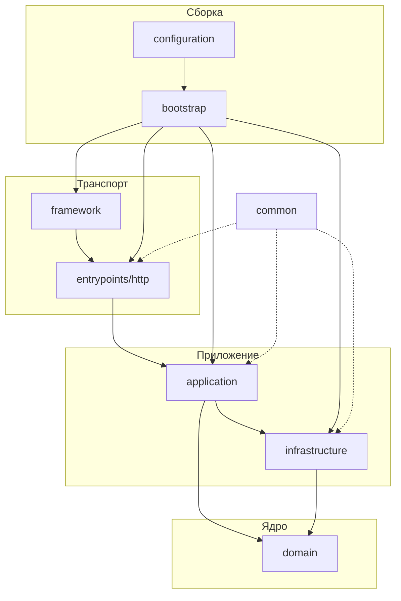
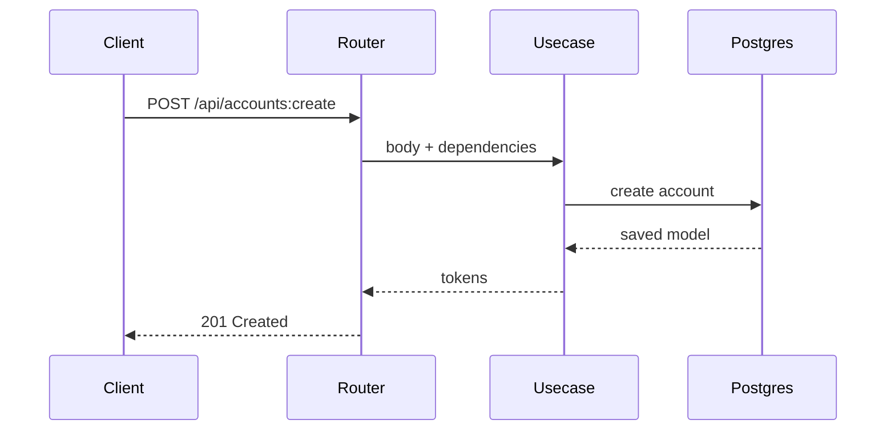

## Архитектура

Проект использует луковичную архитектуру: внешние слои зависят от внутренних, но не наоборот.



## Структура проекта

```text
├── src/
│   ├── application/
│   ├── bootstrap/
│   ├── common/
│   ├── configuration/
│   ├── domain/
│   ├── entrypoints/http/
│   ├── framework/
│   ├── infrastructure/
│   ├── localization/
│   └── static/
├── tests/
│   ├── factories/
│   ├── mocking/
│   ├── test_integrations/
│   └── tools/
├── ARCHITECTURE.md
├── CODESTYLE.md
├── TESTING.md
└── AGENTS.md
```

Распределение ответственности по основным каталогам:
- `domain` хранит бизнес-сущности и ошибки;
- `application` собирает сценарии;
- `infrastructure` реализует доступ к БД, security и внешним клиентам;
- `entrypoints` описывает входные точки в приложение;
- `bootstrap` собирает приложение.

---

## Обработка запроса

Ниже приведён типовой сценарий обработки HTTP-команды:



Ниже приведён пример полного фрагмента реализации для команды создания аккаунта:

```python
# entrypoints/http/public/schemas/account.py
class CreateAccount(Public, Request, Command):
    external_id: str


# entrypoints/http/public/deps/accounts/create.py
def dependency() -> Usecase:
    return Usecase()


# entrypoints/http/public/routers/accounts/create.py
@router.post(
    "/accounts:create",
    status_code=status.HTTP_201_CREATED,
    response_model=Tokens,
    responses=errors(AccountAlreadyExists),
)
async def command(
    usecase: Usecase = Depends(dependency),
    body: CreateAccount = Body(...),
) -> Tokens:
    return await usecase(**body.deserialize())


# application/usecases/accounts/create.py
class Usecase:
    container: types.SimpleNamespace

    def build(self, session: Session) -> None:
        self.container = types.SimpleNamespace(
            repository=types.SimpleNamespace(
                account=repositories.Account(session),
            ),
            security=types.SimpleNamespace(
                encryption=encryption,
                jwt=jwt,
            ),
        )

    async def validate(self, external_id: str) -> None:
        if await self.container.repository.account.exists(Filter.eq(key="external_id", value=external_id)):
            raise AccountAlreadyExists

    @sessionmaker.write
    async def __call__(self, session: Session, external_id: str) -> Tokens:
        self.build(session)
        
        encrypted = self.container.security.encryption.encrypt(external_id)
        
        await self.validate(external_id=encrypted)
        
        account = await self.container.repository.account.create(model=Account.init(external_id=encrypted))
        
        return self.container.security.jwt.encode(subject=str(account.id))
```

В этой структуре:
- schema описывает контракт входных данных;
- dependency создаёт экземпляр usecase;
- router связывает HTTP endpoint с usecase;
- usecase реализует прикладной сценарий и обращается к инфраструктуре.

---

## Тестирование

Ниже приведён пример интеграционного endpoint-теста с использованием БД.

Проверяемый маршрут:

```text
HTTP client -> router -> dependency -> usecase -> repository -> database
```

Особенности подхода:
- проверяется поведение endpoint как прикладной операции;
- данные сценария подготавливаются напрямую через БД;
- Redis при необходимости изолируется локальными mock-объектами;
- тест оформляется как сценарий `setup -> process -> check`.

Ниже приведён пример теста для команды создания аккаунта:

```python
class TestCreateAccount:
    client: AsyncClient

    async def setup(self) -> None: ...

    async def process(self) -> Response:
        return await self.client.post("/api/accounts:create", json={"external_id": fake.uuid4()})

    @classmethod
    async def check(cls, response: Response) -> None:
        assert response.status_code == 201

        tokens = Tokens.model_validate(response.json())

        assert tokens.access
        assert tokens.refresh

    async def test(self, client: AsyncClient) -> None:
        self.client = client

        await self.setup()

        response = await self.process()

        await self.check(response)
```

---

## Документы проекта

Эти документы фиксируют правила проекта и используются как рабочая спецификация:

| Файл               | Назначение                                        |
|--------------------|---------------------------------------------------|
| `ARCHITECTURE.md`  | правила слоёв, структуры и зависимостей           |
| `CODESTYLE.md`     | правила написания Python-кода                     |
| `TESTING.md`       | тестовый подход и паттерны интеграционных тестов  |
| `AGENTS.md`        | краткая карта того, какие документы читать агенту |
